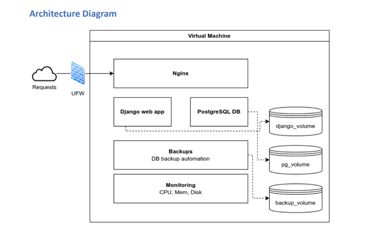

# **Linux-Based Django Web Application Hosting** 

## **Overview**
This project provides a secure, scalable, and production-ready Linux virtual environment to host a Django web application with PostgreSQL, Nginx, and automated backups. It ensures high availability, security, and monitoring using tools like UFW, Netdata, and GitHub Actions for CI/CD.

## **Features**
- **Ubuntu LTS** as the hosting environment  
- **Django & PostgreSQL** setup with secure configurations  
- **Nginx as a reverse proxy** for performance and security  
- **Automated Backups** to prevent data loss  
- **System Monitoring with Netdata** for performance insights  
- **Logical Volume Management (LVM)** for scalability  
- **GitHub Actions CI/CD** for automated testing & deployment  
- **Supports Trunk-Based & Gitflow strategies**  

---

## **Project Architecture** 



The environment consists of:
- **Virtual Machine** – Runs the application securely in an isolated environment.
- **Nginx** – Reverse proxy to route traffic efficiently.
- **Django Web Application** – CRUD based application running on Ubuntu.
- **PostgreSQL** – Database for storing application data.
- **Backups** – Automated daily database and file system backups.
- **Netdata Monitoring** – Monitors system resources (CPU, memory, disk usage).
- **UFW Firewall** – Restricts network access for security.
- **LVM** – Flexible storage management.

---

## **Setup & Installation** ⚙️

### **1. Clone the Repository**
```bash
git clone https://github.com/yourusername/linux-django-hosting.git
cd linux-django-hosting
```

### **2. Virtual Machine & Ubuntu Setup**
- Install **VirtualBox** and allocate at least **2 CPU cores, 4GB RAM, and 20GB storage**.
- Download **Ubuntu LTS** and install it inside the VM.

### **3. Install Dependencies**
Run the following commands to set up the environment:
```bash
sudo apt update && sudo apt upgrade -y
sudo apt install python3 python3-pip python3-venv postgresql nginx ufw netdata
```

### **4. Firewall Configuration (UFW)**
```bash
sudo ufw allow OpenSSH
sudo ufw allow 'Nginx Full'
sudo ufw enable
sudo ufw status verbose
```

### **5. PostgreSQL Setup**
```bash
sudo systemctl start postgresql
sudo systemctl enable postgresql
sudo su - postgres
psql
CREATE DATABASE videogames_db;
CREATE USER django_db_user WITH PASSWORD 'yourpassword';
GRANT ALL PRIVILEGES ON DATABASE videogames_db TO django_db_user;
```
Exit the PostgreSQL shell: `\q`

### **6. Clone Django Project & Install Dependencies**
```bash
cd /var/www/
git clone https://github.com/yourusername/django-web-app.git
cd django-web-app
python3 -m venv venv
source venv/bin/activate
pip install -r requirements.txt
python manage.py migrate
```

### **7. Setup Nginx**
```bash
sudo cp nginx_config /etc/nginx/sites-available/django_app
sudo ln -s /etc/nginx/sites-available/django_app /etc/nginx/sites-enabled/
sudo systemctl restart nginx
```

---

## **GitHub Actions CI/CD Workflow** 🔄

This project includes **GitHub Actions workflows** for automating testing, building, and deploying the application.

### **Workflows Implemented**
✅ **Trunk-Based CI/CD** (For `main` branch)  
✅ **Gitflow CI/CD** (For `develop`, `feature/*`, `release/*`, `hotfix/*` branches)  
✅ **Reusable Workflow** (Called by both strategies)

### **Workflow Structure**
```yaml
# Reusable Workflow (triggers Trunk or Gitflow workflows)
jobs:
  build:
    uses: ./.github/workflows/reusable-workflow.yml
    with:
      branch_type: '${{ github.ref_name }}'
```

To enable workflows:
1. Push changes to GitHub.
2. GitHub Actions will trigger the **corresponding CI/CD workflow**.

---

## **Monitoring & Backups** 📊

### **Netdata Monitoring**
To enable system monitoring:
```bash
curl -sSL https://get.netdata.cloud/kickstart.sh | sudo bash
sudo ufw allow 19999
```
Access it at: **http://127.0.0.1:19999**

### **Automated Backups**
A script runs daily to back up the **PostgreSQL database** and application files:
```bash
sudo nano /var/backups/postgres/backup_postgres.sh
```
```bash
#!/bin/bash
TIMESTAMP=$(date +"%F_%H-%M-%S")
BACKUP_DIR="/var/backups"
DATABASE_NAME="videogames_db"
USER="postgres"
export PGPASSWORD="yourpassword"
pg_dump -U $USER $DATABASE_NAME > "$BACKUP_DIR/$DATABASE_NAME_$TIMESTAMP.sql"
```
Schedule it with **cron**:
```bash
sudo crontab -e
0 2 * * * /var/backups/postgres/backup_postgres.sh
```

---

## **Troubleshooting** 🛠️
### **Common Issues**
❌ **Nginx not starting?**  
✔️ Run `sudo nginx -t` to check for errors.  

❌ **Database connection issues?**  
✔️ Ensure the `credentials.env` file has the correct database credentials.  
✔️ Run `psql -U postgres -d videogames_db` to test connection.  

❌ **Static files not loading?**  
✔️ Run `python manage.py collectstatic` to regenerate static files.  
✔️ Ensure correct permissions:  
```bash
sudo chown -R www-data:www-data /var/www/django_app/static/
sudo chmod -R 755 /var/www/django_app/static/
```

---

## **Contributing** 🤝
1. **Fork** this repository.
2. **Create a feature branch**:  
   ```bash
   git checkout -b feature/new-feature
   ```
3. **Commit your changes**:  
   ```bash
   git commit -m "Added new feature"
   ```
4. **Push to GitHub & Create a Pull Request**.

---

## **License** 📜
This project is licensed under the **MIT License** – feel free to use and modify it.

---

## **Contact & Support** 📩
If you have any questions or need support, feel free to open an **issue** on GitHub or reach out to me via **email**.

---


