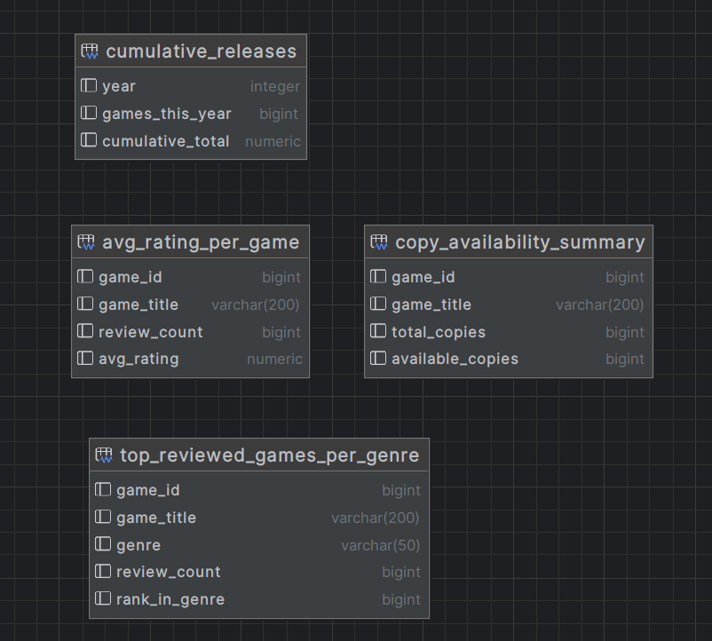

## Executive Summary

This project enhances Threading Labs’ existing Django-based video game catalog application by implementing advanced PostgreSQL database administration techniques to make the system production ready. The primary objective was to introduce robust data control, auditing, performance tuning, and disaster recovery capabilities.

Key achievements include the design and enforcement of least-privilege access through custom PostgreSQL roles, so that each role has only the permissions necessary to perform its own responsibilities. Real-time audit logging was implemented via PL/SQL triggers, allowing the system to capture and store modifications to sensitive tables in a dedicated audit schema.

To support business intelligence and reporting, analytics-ready materialized views were developed. These views allow for efficient querying of aggregated data without placing additional load on transactional tables. Query performance was improved by identifying bottlenecks using and adding indexes on critical columns that were frequently accessed by the application.

An automated backup and restore mechanism was established, with backups scheduled via Windows Task Scheduler. Restore validation is performed in an isolated Docker container to confirm the integrity and completeness of backup files without affecting the production system.

This work not only improves data security and visibility but also supports analytics through a reporting module and ensures a resilient backup strategy. 
Table of Contents
-----------------
- [Architecture](#architecture)
- [Schemas](#schemas)
- [Role Permissions](#role-permissions)
- [SQL](#sql)
- [Backup/Restore Process](#backuprestore-step-by-step)
- [How The Components Work Together](#how-the-components-work-together)

## Architecture
-----------------
The system is built around a Django Web Application composed of:

- **App Module**: Manages transactional operations via the app_writer role.
- **Reporting Module**: Queries optimized materialized views via the app_reader role.
- **Audit Module**: Captures and records DML events into an audit table using the auditor role.
- **Backup Scheduler**: Periodically dumps the entire database using the backup_user role and stores it in external backup storage (the folder in the host machine mounted into the docker container).

The PostgreSQL database is divided into:
- Public schema for main application data
- Analytics schema for materialized views and reporting
- Audit schema for audit logging

Each role is scoped to its own module for a strong security boundary.

## Schemas
--------
### `public` schema

This is the main transactional schema used by the Django application. It includes all core entities required for managing the video game catalog and the user interactions.

It contains tables such as:

- videogame table: Stores all videogame records.
- genre, review, copy, userprofile, developer tables: Supporting entities linked to games and users.
- Standard Django authentication and permission tables: auth_user, auth_group, auth_permission, django_session

Foreign keys for referential integrity between users, games, genres, and other related entities. This schema supports full CRUD operations required by the web application.

### `audit` schema

The audit schema is designed to capture all critical data changes for compliance and traceability.

It includes an audit_log table which includes all the CRUD operations done on the public schema.

Triggers are attached to all critical tables:
- videogame
- genre
- auth_user
- review
- developer
- copy
- userprofile

Each after trigger writes a record to the `audit.audit_log` table for insert, update, or delete actions, capturing the table name, operation, changed data, timestamp, and user.

The `auditor` role has only read access to this schema, and `app_writer` is granted with insert permissions that are necessary for logging.

### `Analytics` Schema

The analytics schema is designed for reporting and analytical workloads. It contains multiple materialized views optimized for business intelligence use cases:

- cumulative_releases: yearly and cumulative game release counts
- top_reviewed_games_per_genre: top 5 reviewed games per genre
- avg_rating_per_game: average ratings across all reviews per game
- copy_availability_summary: availability count of game copies

All views are refreshed periodically and exposed to users with the `report_user` role with read-only access. These views support use cases like management dashboards and BI tools.

All analytic views and performance indexes are included in the SQL snippets provided and are kept isolated from transactional workloads to maintain efficiency and separation of concerns.

## Role Permissions
-------------------

### Role Permissions Comparison

PostgreSQL uses a role based access control model to manage database security. Roles are similar to user groups and can be granted specific privileges such as reading, writing, or administrating data. In this project, roles were used to enforce the principle of least privilege, ensuring each type of user or process has only the permissions necessary for their function.

These roles govern what the user can access or modify in the database. This structured approach improves data security, simplifies permission management, and makes the system easier to audit.

Below is a breakdown of the roles used in this system and their respective permissions:

| Role Name     | Description                                  | Accessible Schemas      | Allowed Actions                                  | Assigned User       |
|---------------|----------------------------------------------|--------------------------|--------------------------------------------------|---------------------|
| `app_reader`  | Read-only role for viewing app data          | `public`                 | `SELECT` on all tables                           | `game_reader`       |
| `app_writer`  | Full CRUD for app, also writes audit logs     | `public`, `audit`        | `SELECT`, `INSERT`, `UPDATE`, `DELETE` on `public`; `INSERT` on `audit_log`; `SELECT` on `audit_log_id_seq` | `game_writer`       |
| `auditor`     | Read-only access to audit logs                | `audit`                  | `SELECT` on all audit tables                    | `audit_user`        |
| `report_user` | Analytics/reporting access                    | `analytics`              | `SELECT` on all materialized views               | `report_user_app`   |
| `backup_role` | Least-privilege access for backup automation | `public`, `audit`, `analytics` | `CONNECT`; `SELECT` on all tables and sequences; `USAGE` on all schemas | `backup_user`       |

## SQL

### Triggers

The system uses PL/SQL triggers to audit changes made to critical tables.
These triggers insert records into the audit.audit_log table whenever an INSERT, UPDATE, or DELETE operation happens.
This enables real-time tracking of user modifications across important entities.

for example:

`CREATE TRIGGER trg_audit_videogame
AFTER INSERT OR UPDATE OR DELETE ON public.videogames_register_videogame
FOR EACH ROW
EXECUTE FUNCTION audit_if_modified();`

You can find all the triggers in the SQL folder of this repository

### Indexes

To improve query performance, several indexes were added to optimize filtering.
Indexes were defined based on profiling via EXPLAIN ANALYZE, and it is shown how the execution task is reduced for the most common queries:

`-- For grouping/searching by genre
CREATE INDEX idx_genre_id ON public.videogames_register_videogame(genre_id);`

**Before Index**

**After Index**

`-- For filtering by date
CREATE INDEX idx_release_date ON public.videogames_register_videogame(release_date);`

**Before Index**

**After Index**

`-- For searching by title
CREATE INDEX idx_title_lower ON public.videogames_register_videogame(LOWER(title));`

**Before Index**

**After Index**

And several more indexes where added to all the tables and their must important columns, you can find them in the SQL folder.

## Materialized Views

The analytics schema contains several materialized views designed to support reporting, trend analysis, and dashboard features.
These views use PostgreSQL’s Window functions, aggregation, and ranking

for example:

`CREATE MATERIALIZED VIEW analytics.cumulative_releases AS
WITH yearly_counts AS (
    SELECT
        EXTRACT(YEAR FROM release_date)::INT AS year,
        COUNT(*) AS games_this_year
    FROM public.videogames_register_videogame
    GROUP BY EXTRACT(YEAR FROM release_date)
)
SELECT
    year,
    games_this_year,
    SUM(games_this_year) OVER (ORDER BY year) AS cumulative_total
FROM yearly_counts
ORDER BY year;
`

This materialized view is also integrated with the Django application frontend

You can find the materialized views in the SQL folder of this repository.

## Backup/restore step by step

First, open Task Scheduler on Windows.
Create a new task:
   - **Trigger**: Daily at 02:00 AM
   - **Action**: Run `python.exe`
   - **Arguments**: `C:\path_to_backup.py` 
   - **Start in**: `C:\path_to_our_project`

After that, just make sure that 'backup.py:
   - Stores SQL backups in backups/ folder if you run it
   - Pulls credentials securely from backup.env file 

After that, is preferably better to have docker desktop installed and running. Then, you can either look for postgres in the searchbar, then pull and run. And enter the right paths for the backup.py.
or, also you can run in powershell the following command:

`docker run -d --name demo 
  -e POSTGRES_PASSWORD=demo_pass 
  -v "C:\Users\youruser\PycharmProjects\Videogames_project\backups:/backups" 
  postgres:latest`

which mounts the backup folder inside our container.

Then, to test it you can run:

`docker exec -it demo bash`

`su - postgres`
`psql -c "DROP DATABASE IF EXISTS videogames_restore_test;"`

`psql -c "CREATE DATABASE videogames_restore_test;"`

`latest=$(ls -1t /backups/videogames_backup_*.sql | head -n1)`

`psql -d videogames_restore_test -f "$latest"`

`psql -d videogames_restore_test -c "SELECT COUNT(*) FROM public.videogames_register_videogame;"`

And the output should be a valid row count, for example 42

## How the Components Work Together
-----------------------------------
This project is structured in a way where each component has a defined responsibility.
The Django web app handles user interaction and data management, interacting with the public schema via the app_writer role.
Also audit module logs changes in real time using triggers and stores them in a separate schema accessible only to the auditor role.
The reporting module accesses materialized views in the analytics schema through the report_user.
Backups are automated using a dedicated backup_user and a scheduled task, with Docker enabling isolated restoration and validation in a test container.

## Reason of The Chosen Architecture
--------------------------------------

This layered architecture ensures separation of concerns, data security, and also operational resilience. By isolating schemas and limiting the role permissions, we apply the principle of least privilege, reducing risk in case of compromise.
Audit logs and materialized views enhance accountability and analytical capabilities without affecting transactional performance. Apart from that, the use of Docker for restoration validation makes sure that backups are not only taken but also tested in a reproducible environment

