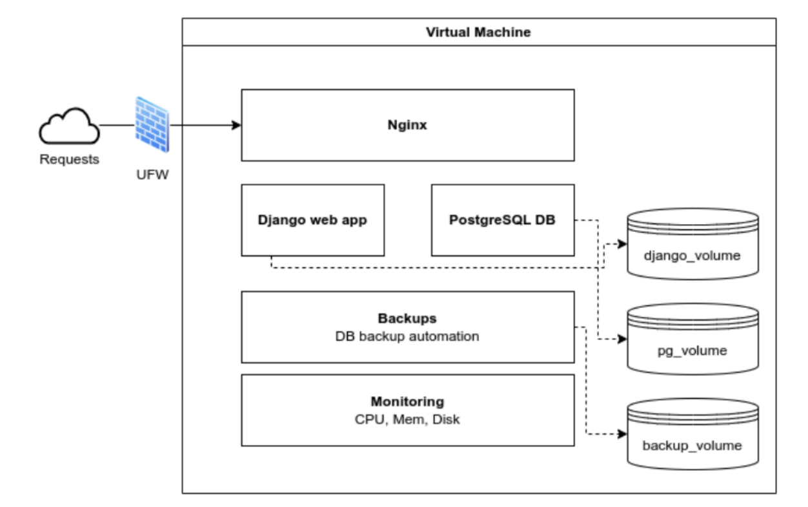

Overview
--------

An end-to-end DevOps solution designed to deploy a Django web application securely and efficiently, integrating technologies such as Django (with CRUD operations, authentication, and permissions) [Django Web Appliation](README.md), PostgreSQL database management, Nginx as a reverse proxy web server, Gunicorn application server, UFW firewall for network security, Ubuntu LTS on a Linux virtual machine for isolated deployment, Logical Volume Management (LVM) for scalable storage, automated backups for disaster recovery, Netdata for real-time monitoring, and automated CI/CD pipelines built with GitHub Actions, with a customized GitHub Workflow, see [GitHub Workflow](Git_Strategies.md) supporting GitFlow and trunk-based strategies.

Table of Contents
-----------------
- [Project Structure](#project-structure)
- [Features](#features)
- [Analysis and Design](#analysis-and-design)
- [System Architecture](#system-architecture)
- [How The Components Work Together](#security)
- [Reason of the Chosen Architecture](#testing)
- [Implementation Guide](#setup-and-deployment-steps)

## Project Structure
-----------------

## Features
--------

- **Django Web App**: CRUD operations, secure login and logout for staff members, user permissions for certain accesses and intuitive UI.
- **Customized GitHub Actions Workflow**: A reusable workflow that gets triggered for both Gitflow and TrunkBased development methodologies.
- **Security and best practices**: CSRF protection, use of environmental variables for database credentials, LVM-based volume isolation, regular automated backups and UFW for allowing only necessary traffic.
- **Monitoring and Maintenance**: Netdata installed for real time monitoring.

## Analysis and Design
-------------------

### System Architecture

Components
----------

### 1. Virtual Machine

- **Purpose**:  
  The virtual machine is the base of the infrastructure. It provides an isolated and secure environment to host the web application, database, and supporting tools. It ensures efficiency in resource management, scalability, and reliability for the production environment.

- **Role in the architecture**:  
  Hosts the Linux environment (Ubuntu LTS) required to safely run all project components. It guarantees system independence, minimizing external interference, and ensures consistent performance. This setup also simplifies future migration to cloud platforms.

### 2. Nginx Web Server

- **Purpose**:  
  Lightweight, high-performance web server and reverse proxy responsible for handling incoming HTTP/HTTPS requests and routing them to the Django application.

- **Role in the architecture**:  
  Acts as a reverse proxy, forwarding client requests to the Django application, serving static files, and securing connections by enabling TLS encryption, protecting user requests against interception or modification.

### 3. Django Web Application

- **Purpose**:  
  The Django web application is the core of the project, responsible for providing CRUD management functionalities for the videogames catalog.

- **Role in the architecture**:  
  Handles user interactions, manages business logic, and communicates with the PostgreSQL database to retrieve and store data. It runs on a dedicated logical volume (`django_volume`) for improved isolation and simplified storage management.

### 4. PostgreSQL Database

- **Purpose**:  
  Stores all the videogame data managed by the web application.

- **Role in the architecture**:  
  Manages and stores videogame data such as titles, genres, release dates, and descriptions. It utilizes a dedicated logical volume (`pg_volume`) to separate data storage from other system files, improving security and performance.

### 5. Automated Backups

- **Purpose**:  
  Ensures data integrity and allows quick recovery in the event of system failure or disasters.

- **Role in the architecture**:  
  Automatically performs regular backups of the PostgreSQL database and critical application files, storing these backups in a dedicated logical volume (`backup_volume`) to minimize downtime in case of data loss.

### 6. Monitoring (Netdata)

- **Purpose**:  
  Tracks real-time system performance metrics such as memory usage, CPU load, and disk space utilization.

- **Role in the architecture**:  
  Detects potential issues like high resource usage early and alerts administrators, enabling proactive management to ensure ongoing system stability.

### 7. UFW Firewall

- **Purpose**:  
  Secures the virtual machine by controlling incoming and outgoing network traffic.

- **Role in the architecture**:  
  Ensures only essential network ports (SSH, HTTP, HTTPS) are accessible, preventing unauthorized access and protecting the application from external threats.

### 8. Logical Volume Management (LVM)

- **Purpose**:  
  Provides flexibility and scalability for disk storage management, allowing for controlled data growth.

- **Role in the architecture**:  
  Allocates dedicated logical volumes for organized storage of the web application, PostgreSQL database, and automated backups. It allows resizing storage dynamically without service disruption, ensuring scalability and continuous operation.

## How the Components Work Together
-----------------------------------
Incoming Requests enter the system by the UFW, which is mean to ensure that only
legitimate traffic is allowed, by restricting access to only specific ports for HTTP and HTTPS.
Once validated, Nginx is in charge of processing this requests, and forwarding to the web
application.
The Django web application handles the user interaction and requests so that when data is
required, it interacts with the PostgreSQL database. The database is isolated in its own
pg_volume, ensuring efficiency in the performance and better security. Automated backups
are scheduled at a certain time of the day to provide recoveries. Backups include all the
database files from the pg_volume. These backups are stored in another dedicated
backup_volume, for an easy recovery in case of system failures.
Regarding the monitoring, the system monitoring tools have alerts configured to detect
potential issues to encourage their fast resolution.
In terms of scalability, the LVM makes the architecture designed for future growth. Either if
user demands or data volume increases, the storage volumes can be resized dynamically
without disrupting the system.

## Reason of The Chosen Architecture
--------------------------------------
This architecture establishes security by controlling invalid access and filter the malicious
requests. It has great level of reliability, since the components are isolated and the possibility
of having issues does not mean having them everywhere but only in their own isolated
environment. The automated backups protect the system from disasters. Moreover, the
architecture provides scalability, performance metrics and management easiness where
manual effort for backups is reduced and logical volumes also simplify the disk management.

## Implementation Guide

For the full implementation Guide see [Linux Environment Documentation PDF](Linux Environment Documentation.pdf)

